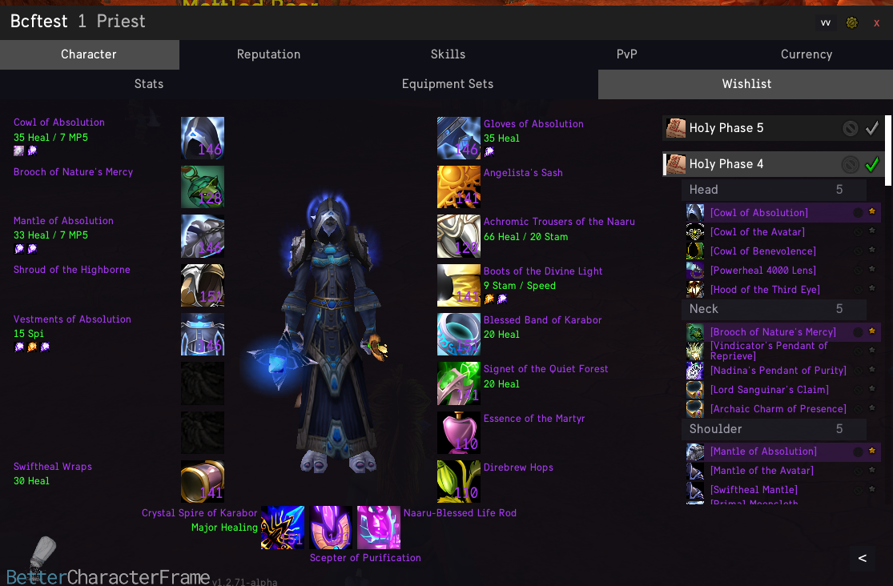
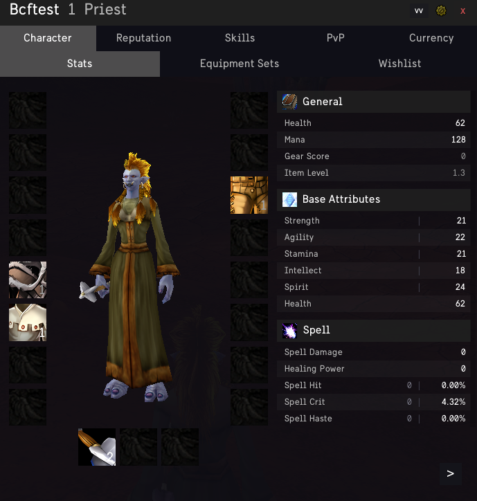

# 

**A modern, all-in-one overhaul for the TBC Classic character panel.**

BetterCharacterFrame consolidates enhanced character stats, gear set management, intelligent reputation tracking, BiS Wishlists, and much more into a single, native-feeling experience focused on usability and performance.

---

## Screenshots

| Gear and Wishlist | Stats Panel |
|---|---|
|  |  |

---

## Key Features

### All-In-One Interface
- **Detailed Stats** -- Comprehensive display of Hit, Haste, Expertise, and Crit ratings
- **Reputation Tracker** -- Dedicated view for monitoring standing with relevant factions
- **Equipment Manager** -- Create, update, and equip gear sets directly from the character panel
- **Wishlist Engine** -- Built-in BiS tracking based on Wowhead data
- **Enchants and Gems** -- Visual indicators for every enchant and gem on your gear

### Performance and Design
- **Zero Bloat** -- Lightweight codebase optimized for low CPU and memory usage
- **Modern Aesthetics** -- Designed to enhance the native functionality of the character frame
- **Fluid Animations** -- Smooth transitions and instant tab switching

## Installation

1. [Download the latest release zip](https://github.com/saltmachine7/BetterCharacterFrame/releases/latest/download/BetterCharacterFrame-v1.4.42.zip)
2. Extract to `Interface/AddOns/`
3. The extracted folder is `BetterCharacterFrame`
4. Login and press `C` or click the icon in the micro-bar
5. Manage gear sets or load your class BiS via the Wishlist tab

---

## Support

For bug reports and feature requests, please use the [Issue Tracker](https://github.com/saltmachine7/BetterCharacterFrame/issues).
